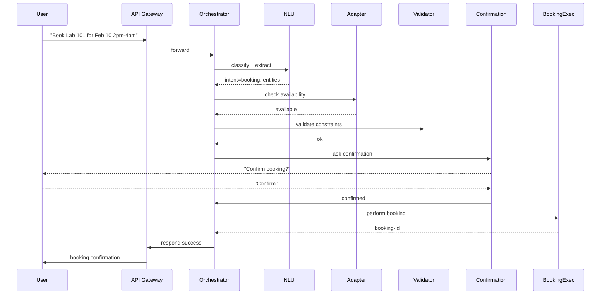

AI Campus Agent — Architecture

High-level goals
- Classify user intents (events, facilities, bookings)
- Retrieve authoritative data from campus systems via adapters
- Validate availability and operational constraints using institutional records
- Confirm user intent before any booking action
- Provide transparent responses and error handling

Components
1. User Interface (UI)
   - Chat / Voice / Mobile app / Web widget
   - Sends user message to Agent API

2. API Gateway
   - Authentication, rate-limiting, basic input sanitization
   - Routes requests to the Orchestrator service

3. Orchestrator / Controller
   - Central decision-making unit that runs the request pipeline:
     a. NLU / Intent Detection
     b. Intent Router (decide which system to consult)
     c. Data Retriever (system adapters)
     d. Constraint Validator (business rules engine)
     e. Confirmation Manager (ask for explicit confirmation if needed)
     f. Executor (perform booking transaction)
     g. Response Composer (final user response)

4. NLU Service
   - Intent classifier + entity extractor + slot filler
   - Uses hybrid approach:
     - Transformer-based classifier for intent (e.g., sentence-transformers)
     - Rule-based fallback (spaCy) for domain-specific tokens (room numbers, lab names, times)

5. System Adapters (connectors)
   - Events System Adapter: REST/GraphQL to campus Calendar system
   - Facilities DB Adapter: SQL queries to Facilities DB
   - Booking System Adapter: REST API for reservations
   - Auth & Directory Adapter: for user identity and permissions

6. Constraint Validator
   - Checks:
     - Availability windows (working hours, maintenance windows)
     - Capacity limits (room occupancy)
     - Resource conflicts (double-booking)
     - Access control (user allowed to book?)
   - Implemented as rules, evaluated per request. Uses caching for commonly-used constraints.

7. Transactional Booking Executor
   - Performs booking with two-phase commit / DB transaction or booking API transaction
   - Emits events to Notification Service (email/SMS)

8. Audit & Logging
   - All actions (queries, confirmations, bookings) logged for traceability

9. Async Task Queue
   - Long-running tasks (batch sync, heavy retrieval) handled via Celery / Redis

10. Knowledge Base / Retriever
   - For FAQs and static facility info, use vector store (e.g., FAISS) + embeddings

Flow (sequence)
1. User sends a message
2. API Gateway -> Orchestrator
3. NLU classifies intent and extracts entities
4. Orchestrator decides systems to consult
5. Data Retriever queries the adapters
6. Constraint Validator evaluates time, capacity, policy
7. If action required (booking), Confirmation Manager asks user to confirm
8. On explicit confirmation, Executor performs booking and returns result
9. Response Composer creates human-friendly output and notifies user

Decision points
- Intent detection confidence threshold -> if low, ask clarifying question
- Whether availability checks needed -> for "Is Room X free?" yes; for "Tell me about Room X" maybe not
- Whether confirmation required -> booking actions always require explicit confirm; deletion or changes may require stricter auth

Mermaid flow (below)

```mermaid
flowchart TD
  A[User Message] --> B[API Gateway]
  B --> C[Orchestrator]
  C --> D[NLU: Intent + Entities]
  D --> E{Intent}
  E -->|Events| F[Events Adapter]
  E -->|Facilities| G[Facilities Adapter]
  E -->|Bookings| H[Booking Adapter]
  F --> I[Constraint Validator]
  G --> I
  H --> I
  I --> J{Constraints OK?}
  J -->|No| K[Compose Denial / Alternatives]
  J -->|Yes| L{Requires Booking?}
  L -->|No| M[Compose Info Response]
  L -->|Yes| N[Confirmation Manager]
  N --> O{User Confirms?}
  O -->|No| P[Abort, Compose Response]
  O -->|Yes| Q[Executor (Booking Transaction)]
  Q --> R[Notification Service]
  R --> S[Compose Success Response]
  S --> T[User]
```

Sequence diagram (booking)



Security & Privacy
- Authenticate users via SSO (SAML / OAuth2)
- Authorize bookings by role (faculty, staff, students) and by resource policy
- Audit all booking actions and retention policies

Scalability
- Stateless Orchestrator (Kubernetes pods)
- Caching layer (Redis) for facility metadata and constraint lookups
- Vector DB (FAISS or Milvus) for KB retrieval

Operational notes
- Regularly sync campus source-of-truth systems overnight
- Provide manual override process for admins
- Monitor latency of external adapters and degrade gracefully
